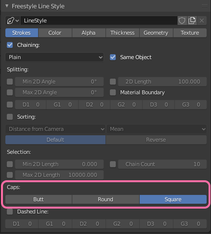

# Blender Pixel Art

1. Set Scene Dimensions to a multiple of 32 px (32, 64, 128...)
2. Set filter size to 0 px in Render Tab > Film > Filter Size
3. (opt.) Change camera to Orthographic
4. Use Flat Toon Shaders
5. Tip: subdivide or add multiresolution modifier if bad shading

## Pixel Lineart with Freestyle

Set Freestyle thickness to 1

AA: Render Properties > Sampling > Render
1: Disables AA
2: Simulates manual AA

